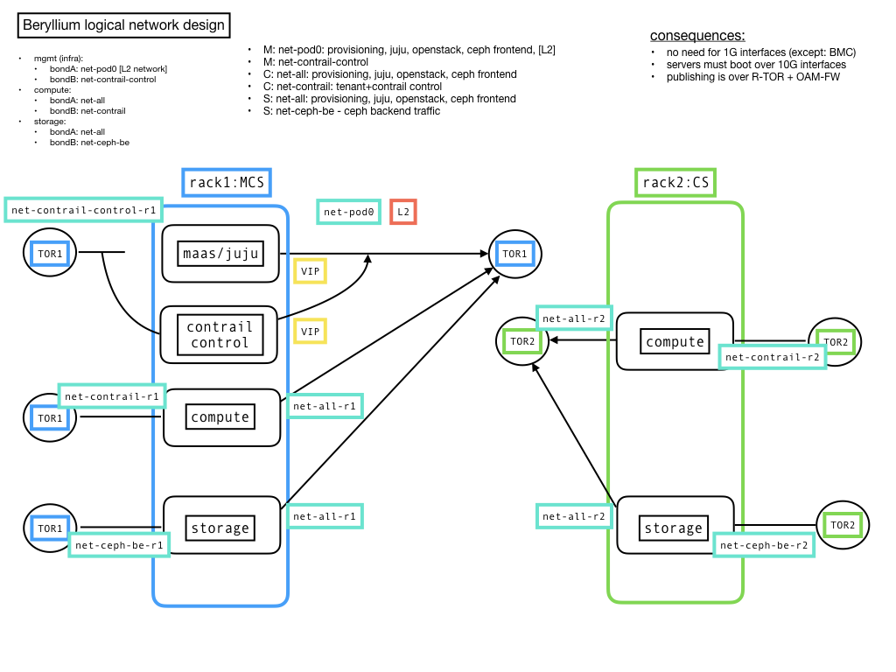

---
## Campus 2018Q2, Zagreb
laszlo.angyal@pan-net.eu

---
- Beryllium development
- Openstack Summit 2018 May, Vancouver
- AT&T v. Pan-Net

---
## Beryllium: Design, Build, Operate

<span style="font-size:0.6em">
https://gitlab.tools.in.pan-net.eu/groups/cid/-/milestones/28
</span>

this milestone is used as a summary of activities; examples:
```
- versions to be used
- Li-Be differences highlights
- generic code: deployment
- environment manifest: environments.yaml
- environment specific code: environments
- feature requests
- online documentation
```

---
## beryllium project

<span style="font-size:0.6em">
https://gitlab.tools.in.pan-net.eu/cid/beryllium
</span>

we use three project milstones:
```
- beryllium/design (Day 0)
- beryllium/build (Day 1)
- beryllium/operate (Day 2)
```

---
#### Be design highlights: versions

Lithium -> Beryllium
```
- Ubuntu version: trusty/14.04 -> xenial/16.04
- Kernel version: 4.x
- Contrail version: 3.2.x -> 4.1.x
- Openstack version: Mitaka -> Ocata
- CEPH version: Jewel/10.2.x 
- infra units: trusty/14.04 -> xenial/16.04
- maas: 2.x
- juju: 2.x
- openstack-charms: 16.04 ->latest
```

---
#### Be design highlights: rack->server

Lithium: rack-role-driven design
```
- rack-role-driven design
- storage rack
- compute rack
- management rack
```

Beryllium: server-role-driven design
```
- unified rack
- server role defines config
- no special mgmt rack design
```

---
#### Be design highlights: management cluster design

Lithium:
```
- separated mgmt rack(s)
- L2 networks
```

Beryllium:
```
- we still have to use L2
- experimental: DNS based
- goal: switch to L3 technology
- currently, scaling at the mgmt plane is not an issue
```

---
#### Be design highlights: Infrastructure as Code

stages:
```
[greenfield]: even the network is unconfigured
[ready-for-foundation]: 3 infra nodes + network is configured
[ready-for-cloud]: foundation is deployed
[ready-for-postdeployment]: cloud is deployed
[ready]: post-deployment applied also
```

Lithium:
```
- gitlab pipeline can be run from stage [ready-for-cloud]
```

Beryllium:
```
- gitlab pipeline can be run from stage [ready-for-foundation]
- gitlab integrated development
- documentation as code (gitlab pages)
- code review: next challenge
```

---
#### Be design highlights: logical networks


---
#### Be design highlights: multi-site

Lithium: not considered

Beryllium: considered
```
- ip anycast
- object storage replication
- global health check
```

---
## Openstack Summit 2018 May, Vancouver

- building the cloud
- using the cloud
- interesting topics

---
#### Openstack Summit: building the cloud #1

- openstack-helm
  - build openstack via helm charts: <span style="font-size:0.6em"> https://github.com/openstack/openstack-helm-infra </span>

- kolla
  - kolla-ansible: <span style="font-size:0.6em"> https://docs.openstack.org/kolla-ansible/latest/ </span>
  - kolla-kubernetes: <span style="font-size:0.6em"> https://docs.openstack.org/kolla-kubernetes/latest/ </span>

- triple-O
  - use openstack for openstack <span style="font-size:0.6em"> https://docs.openstack.org/tripleo-docs/latest/ </span>

---
#### Openstack Summit: building the cloud #2

Airship: http://www.airshipit.org
- AT&T: Rodolfo Pacheco, Alan Meadows
- basically, openstack-helm _extra_
- <span style="font-size:0.6em"> https://www.youtube.com/watch?reload=9&v=ckcLnBqGQrQ </span>

---
#### Openstack Summit: building the cloud #3

Juju charms update, James Page / Canonical
```
- neutron dynamic routing using BGP
- encryption data at rest
    - dm-crypt/LUKS
    - key mgmt: Vault (Hashicorp)
- TLS cert. mgmt
- Ubuntu 18.04 LTS support
- openstack
    - panko (telemetry)
    - ceph bluestore validation
    - fernet tokens
    - rocky release
    - cells v2
    - octavia
    - expanded cert mgmt
    - later: API load balancer, OVN (Open Virtual Network) 
```

---
#### Openstack Summit: building the cloud #4

edge / distributed cloud
```
- academic: Openstack and Edge - <span style="font-size:0.6em"> https://wiki.openstack.org/wiki/Fog_Edge_Massively_Distributed_Clouds </span>
  - summary: partially YES, basically NO
  - some effort on keystone side: trying different DB backends/scenarios
- starlingX: <span style="font-size:0.6em"> https://github.com/starlingx-staging/ </span>
```

---
#### Openstack Summit: using the cloud #1

```
- katacontainers: https://katacontainers.io/
  - at the speed of a container
  - with the security of a VM
- kubevirt: running VM (!) in kubernetes - http://www.kubevirt.io/
- kubevirt + katacontainers: <span style="font-size:0.6em"> http://superuser.openstack.org/articles/kubevirt-kata-containers-vm-use-case/ </span>
```

---
#### Openstack Summit: using the cloud #2

openstack + containers
```
- white paper: <span style="font-size:0.6em"> https://www.openstack.org/containers/whitepaper </span>
- speech: <span style="font-size:0.6em"> https://www.youtube.com/watch?v=qaegQb5WiNY </span>
- magnum: OS project to help deploying a kubernetes cluster
- zun: OS project to run "just containers"
- stackube: OS project to provide OS plugins for kubernetes
```

---
#### Openstack Summit: using the cloud #3

getting started with kubernetes
```
- minikube: <span style="font-size:0.6em"> https://kubernetes.io/docs/getting-started-guides/minikube/ </span>
- microK8S: <span style="font-size:0.6em"> https://github.com/juju-solutions/microk8s/ </span>
- kubernetes with 3 VMs: <span style="font-size:0.6em"> https://itnext.io/kubernetes-on-ubuntu-on-virtualbox-60e8ce7c85ed </span>
```

---
#### Openstack Summit: using the cloud #4

interesting topics
```
- zuul: "Stop Merging Broken Code"
- secustack: image, volume encryption
- vitrage: openstack Root Cause Analysis
- infinidat: CEO is Moshe Yanai (Symmetrix, XIV)
- istio: connect, manage, and secure microservices
```

---
## AT&T v. Pan-Net

---
#### AT&T
```
- cloud operating system: Ubuntu
- framework: openstack-helm (kubernetes)
- product: airship, opensource
- in production: yes, ~12 deployment supporting 5G
```

#### Pan-Net:
```
- cloud operating system: Ubuntu
- framework: juju
- product: IC, private (currently)
- in production: yes
```

---
#### AT&T v. Pan-Net

what we should learn from them:
```
- focus on source code management
  - manifest files
  - environments files
  - .gitlab-ci.yml
  - templates
- pre-validation
- approval process
```

---
# thank you

